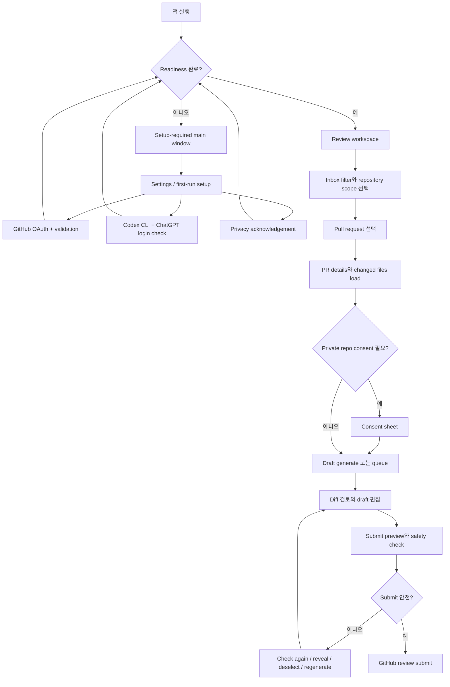

# 사용자 흐름

상태: 2026-05-24 구현과 일치하는 현재 상태 사용자 흐름.

## 흐름 지도

## UF-01: Launch와 Settings Gate

Trigger: 사용자가 PR Review Desk를 엽니다.

1. 앱은 main window와 app model을 생성합니다.
2. Normal launch에서는 저장된 GitHub session restoration과 Codex readiness refresh를 시도합니다.
3. Readiness checklist는 GitHub credential, GitHub token validation, Codex CLI와 ChatGPT login, privacy acknowledgement를 평가합니다.
4. 필수 item 중 하나라도 ready가 아니면 main window는 setup-required content와 Settings access를 보여줍니다.
5. 모든 필수 item이 ready이면 main window는 review workspace를 보여줍니다.

분기:

- 저장된 OAuth token 없음: GitHub readiness는 incomplete로 남습니다.
- 저장된 credential이 unsupported: 앱은 삭제하고 GitHub sign-in을 요청합니다.
- Codex가 없거나 unsupported mode로 login됨: AI review setup은 incomplete로 남습니다.
- Privacy가 acknowledged되지 않음: acknowledged될 때까지 setup은 incomplete입니다.

## UF-02: GitHub OAuth Device Sign-In

Trigger: 사용자가 Settings, first-run setup, empty state에서 Sign in with GitHub를 선택합니다.

1. 앱은 configured GitHub OAuth client ID와 `repo` scope로 OAuth device flow를 시작합니다.
2. GitHub는 verification URI, device code, user code, interval, expiration을 반환합니다.
3. 앱은 browser에서 GitHub를 열고 pending user code를 표시합니다.
4. 사용자는 GitHub에서 authorize합니다.
5. 앱은 success, slow-down, pending, expiration, denial, cancellation, error 중 하나가 될 때까지 access-token endpoint를 poll합니다.
6. Success 시 앱은 OAuth user token과 metadata를 저장하고, GitHub client를 구성하고, token login/scope를 validate하고, repositories를 refresh합니다.

분기:

- 사용자가 cancel: status는 cancelled가 되고 credential은 persist되지 않습니다.
- Code expires: 사용자는 sign-in을 다시 시작해야 합니다.
- Access denied: 사용자는 sign-in을 retry할 수 있습니다.
- OAuth/network error: redacted details가 포함된 recoverable error를 보여줍니다.

## UF-03: Codex Readiness

Trigger: 사용자가 Check Codex를 선택하거나 앱이 launch readiness refresh를 수행합니다.

1. 앱은 `which codex` 또는 알려진 Homebrew/local path로 Codex executable을 resolve합니다.
2. 앱은 짧은 timeout으로 `codex login status`를 실행합니다.
3. Output은 ChatGPT login일 때만 ready로 분류됩니다.
4. Missing CLI, nonzero status, API-key login, access-token login, unknown successful output은 readiness를 incomplete로 유지합니다.
5. Settings와 first-run setup은 필요할 때 `codex login` copy/open helper action을 제공합니다.

분기:

- Codex not installed: first-run advanced option에서 install-help copy action을 제공합니다.
- Codex installed but not signed in: sign-in helper action을 제공합니다.
- Codex signed in through unsupported method: ChatGPT login requirement를 설명합니다.

## UF-04: Privacy Acknowledgement와 Private Repository Consent

Trigger: 사용자가 app을 setup하거나 private repository context를 Codex로 보내려 합니다.

1. Global privacy acknowledgement는 review workspace access 전에 필요합니다.
2. Public repository는 global setup 후 AI generation과 queue processing을 진행할 수 있습니다.
3. Private repository는 remembered repository consent를 확인합니다.
4. 기억된 consent가 없으면 앱은 outbound data category를 설명하는 consent sheet를 엽니다.
5. 사용자는 cancel 또는 allow and continue를 선택할 수 있습니다.
6. Allow하면 repository full name을 user defaults에 기록하고 pending operation을 재개합니다.

분기:

- Selected PR generation에서 cancel: generation은 시작되지 않습니다.
- Queue processing 중 cancel: queued item은 queued 상태로 남고 queue processing은 pause됩니다.
- 사용자가 Settings에서 remembered consent를 clear: private repository prompt가 다시 나타납니다.

## UF-05: Repository Loading과 범위 선택

Trigger: 사용자가 Load repositories, Refresh를 선택하거나 GitHub sign-in을 완료합니다.

1. 앱은 GitHub REST로 accessible repositories를 list합니다.
2. 이전 repository selection이 여전히 있으면 ID 기준으로 보존합니다.
3. Selected repository가 바뀌면 PR context를 clear합니다.
4. Repository를 선택하면 해당 repository의 open PR을 load합니다.
5. Sidebar는 selected repository, optional expanded repository list, repository search, private/public indicator를 보여줍니다.

분기:

- No repositories: sidebar는 empty row와 load/sign-in action을 보여줍니다.
- Repository search no matches: no-match row와 clear action을 보여줍니다.
- Selected private repo에 대한 GitHub access 부족: action은 recovery guidance와 함께 block됩니다.

## UF-06: Review Inbox Filter Selection

Trigger: 사용자가 inbox filter를 click하거나 command panel filter action을 사용합니다.

1. Sidebar는 Review Inbox, Draft Ready, Stale, Running, Needs Setup, Submitted 순서로 filter를 노출합니다.
2. Review Inbox는 submitted가 아닌 actionable PR row를 모두 보여줍니다.
3. Draft Ready, Stale, Running, Submitted는 matching draft status row를 보여줍니다.
4. Needs Setup은 setup이 incomplete일 때만 first-run setup content를 보여줍니다.
5. 사용자가 row가 0개인 filter를 선택하면 filter는 선택 상태를 유지하고 content column은 해당 empty state를 보여줍니다.
6. 현재 selected PR이 user-selected filter에 의해 hidden되면 앱은 이전 section으로 되돌아가지 않고 selected PR을 clear합니다.
7. Row 변경이 content change 때문이면 앱은 selected row의 실제 section으로 이동해 content visibility를 유지할 수 있습니다.

분기:

- Search active: empty state는 search가 row를 숨기고 있음을 강조하고 Clear search를 제공합니다.
- Selected repository has no open PRs: Review Inbox empty state는 해당 repository에 open PR이 없음을 설명합니다.
- 사용자가 Running을 click했는데 queued/generating이 없음: Running은 선택 상태를 유지하고 가능한 경우 draft creation을 제안합니다.

## UF-07: Pull Request Selection

Trigger: 사용자가 visible PR row를 선택합니다.

1. 앱은 loaded repositories 또는 row 자체에서 row repository를 resolve합니다.
2. Repository가 다르면 앱은 해당 repository를 선택하고 open PR을 load합니다.
3. 앱은 PR을 선택하고 이전 draft/diff/focus state를 clear하며 current PR details를 fetch합니다.
4. 앱은 changed files를 fetch하고 first selected file을 set하며 preflight head SHA와 safety check time을 기록합니다.
5. Repository와 PR에 대한 saved draft가 있으면 latest draft를 restore합니다.

분기:

- Saved draft head가 current head와 일치: draft는 ready로 restore됩니다.
- Saved draft head가 다름: draft는 stale로 restore되고 submission 전 regenerate가 필요합니다.
- GitHub request 실패: recoverable error가 나타나고 status가 failure를 보고합니다.

## UF-08: Selected PR Draft Generate

Trigger: 사용자가 Generate AI Review Draft를 선택합니다.

1. 앱은 not working, selected PR, repository access, readiness checklist, private repository consent를 확인합니다.
2. 앱은 cancellable generation을 시작합니다.
3. 앱은 Codex ChatGPT login을 다시 verify합니다.
4. 앱은 PR details와 changed files를 refetch합니다.
5. 앱은 PR review context를 fetch합니다: PR body, issue comments, review comments, check runs.
6. 앱은 PR metadata, bounded context, annotated reviewable patches로 Codex prompt를 만듭니다.
7. 앱은 read-only sandbox, ephemeral mode, output schema, output file로 `codex exec`를 실행합니다.
8. 앱은 JSON을 summary, risks, inline comments로 decode합니다.
9. 앱은 reviewed head SHA, selected event Comment, draft, review body, preflight head SHA, safety timestamp, presentation revision을 set합니다.
10. Draft key가 있으면 draft를 local에 persist합니다.

분기:

- Reviewable file 없음: generation은 no-reviewable-files error로 fail합니다.
- 일부 file omitted: generation은 성공하고 coverage warning이 omitted files를 설명합니다.
- 사용자가 cancel: operation이 stop되고 status가 cancellation을 보고합니다.
- Codex fail 또는 timeout: redacted details가 있는 recoverable error가 나타납니다.

## UF-09: Background Draft Queue

Trigger: 사용자가 Add Draft, Add drafts, queue start를 선택합니다.

1. Add Draft는 selected repository/PR을 enqueue합니다.
2. Add drafts는 selected repository의 모든 open PR을 enqueue합니다.
3. Queue는 repository full name과 PR number 기준으로 deduplicate합니다.
4. Queue processing은 각 queued item을 generating으로 mark합니다.
5. 각 item에 대해 repository access, private consent, Codex readiness, PR details, files, review context, Codex generation을 verify합니다.
6. Generated draft는 local draft store에 저장됩니다.
7. Queue item은 reviewed head SHA와 draft body를 가진 Draft Ready가 됩니다.
8. Generated item이 current selection과 일치하면 current workspace가 generated draft를 적용합니다.

분기:

- Stop creating drafts: current task는 cancel되고 not-started item은 queued로 남습니다.
- Failed 또는 stale item: row는 Retry를 제공합니다.
- Remove item: queue item이 제거되고 matching stored draft가 삭제됩니다. 단 generating item은 제외입니다.
- Submitted item: submission 후 item은 Submitted status로 이동합니다.

## UF-10: Diff Review Workspace

Trigger: PR에 changed files가 load되어 있습니다.

1. Detail pane은 PR header, AI review action strip, optional coverage banner, review controls를 보여줍니다.
2. Changed file이 하나면 selected file detail이 inline으로 나타납니다.
3. 여러 file이면 changed files pane이 selected file detail 옆에 나타납니다.
4. File row는 path, status, additions, deletions, viewed state, omitted indicator, inline comment count를 보여줍니다.
5. Selected file detail은 path, status, additions/deletions, draft version availability, diff mode picker, whitespace toggle, viewed toggle, collapse toggle을 보여줍니다.
6. Diff viewer는 old/new line gutter, GitHub position gutter, code line, semantic color, inline comments, focus highlight를 render합니다.

분기:

- Changed files가 load되지 않음: empty state는 Refresh pull request 또는 Generate AI Review Draft를 제공합니다.
- File collapsed: detail은 File Collapsed와 Expand File action을 보여줍니다.
- Omitted file: diff text는 reviewable changes가 없어 Codex로 보내지 않았음을 설명합니다.

## UF-11: Draft Editing과 Inline Comment Review

Trigger: generated 또는 restored draft가 존재합니다.

1. Inspector는 review event picker와 Submit Review button을 보여줍니다.
2. Submit safety panel은 draft가 submit 가능한지 보고합니다.
3. AI Trust panel은 generated head SHA와 omitted file count를 보여줍니다.
4. Draft editor는 review body와 path별 grouped inline comments를 보여줍니다.
5. 사용자는 review body를 edit합니다.
6. 사용자는 inline comment를 selected/unselected로 toggle합니다.
7. 사용자는 inline comment body text를 edit합니다.
8. 사용자는 diff에서 inline comment를 reveal합니다.
9. Current draft key가 있으면 edit가 local에 persist됩니다.

분기:

- Draft 없음: inspector는 No Draft Yet과 Generate action을 보여줍니다.
- Inline comment가 current diff와 더 이상 맞지 않음: safety state가 감지한 뒤 row가 invalid warning을 보여줍니다.
- 사용자가 draft discard: confirmation이 local draft를 제거하고 draft state를 clear합니다.

## UF-12: Submit Preview와 GitHub Submission

Trigger: 사용자가 toolbar, inspector, menu, command panel에서 Submit Review를 선택합니다.

1. 앱은 preview가 available한지 확인합니다.
2. 가능하면 confirmation을 보여주기 전에 PR details와 files를 refresh합니다.
3. 앱은 current head SHA, changed files, selected file, safety timestamp, stale queue state를 update합니다.
4. Preview sheet는 event, selected inline comment count, body, comments, safety message, selected/invalid count, version details를 보여줍니다.
5. Unsafe이면 Submit은 disabled되고 preview는 Check Again, Regenerate, Reveal, Deselect를 제공합니다.
6. Safe이면 사용자가 Submit을 click합니다.
7. 앱은 event, review body, reviewed head SHA, selected inline comments로 GitHub review를 submit합니다.
8. Matching background queue item은 submitted로 mark되고 status가 success를 보고합니다.

분기:

- Current head가 reviewed head와 다름: preview는 stale로 block합니다.
- Selected inline comment가 current diff position에 없음: preview는 fix 전까지 block합니다.
- Diff position을 validate할 수 없음: preview는 block합니다.
- GitHub submit 실패: recoverable error가 표시되고 submitted로 mark하지 않습니다.

## UF-13: Command Panel과 Keyboard Flow

Trigger: 사용자가 Command-K를 누르거나 Actions를 선택합니다.

1. Command panel이 열리고 search에 focus됩니다.
2. Command는 Review Actions, Draft Lists, Navigation, View, Inbox Filters로 group됩니다.
3. 사용자는 command를 search하고, arrow key로 selection을 이동하고, Return으로 selected enabled action을 실행할 수 있습니다.
4. Query가 비어 있으면 disabled command도 next-step guidance와 함께 visible합니다.

Keyboard shortcut 목록:

- Command-K: Actions.
- Command-R: Refresh.
- Shift-Command-R: Generate AI Review Draft.
- Command-Period: Cancel Review Generation.
- Command-Return: Submit Review.
- Command-O: Open PR.
- Command-RightBracket/LeftBracket: next/previous inline comment.
- Shift-Command-RightBracket/LeftBracket: next/previous file.
- Option-Command-RightBracket/LeftBracket: next/previous change block.
- Option-Command-I: Toggle Inspector.

## UF-14: Settings Maintenance Flow

Trigger: 사용자가 Settings를 엽니다.

1. 사용자는 appearance를 System, Light, Dark로 바꿀 수 있습니다.
2. 사용자는 language를 System, English, Korean으로 바꿀 수 있습니다.
3. Readiness section은 GitHub, Codex, privacy state와 action을 보여줍니다.
4. GitHub section은 sign-in/reconnect, cancel pending sign-in, copy code, open GitHub, manage GitHub, retry restore, delete local credential, validate를 지원합니다.
5. Codex section은 Check Codex, copy sign-in step, open Terminal sign-in step을 지원합니다.
6. Privacy section은 acknowledgement와 remembered private repository consent clearing을 지원합니다.

분기:

- Credential 삭제: GitHub client, repositories, selected PR, changed files, draft, granted scopes, credential metadata를 clear합니다.
- Language 변경: 가능한 default status string을 relocalize합니다.
